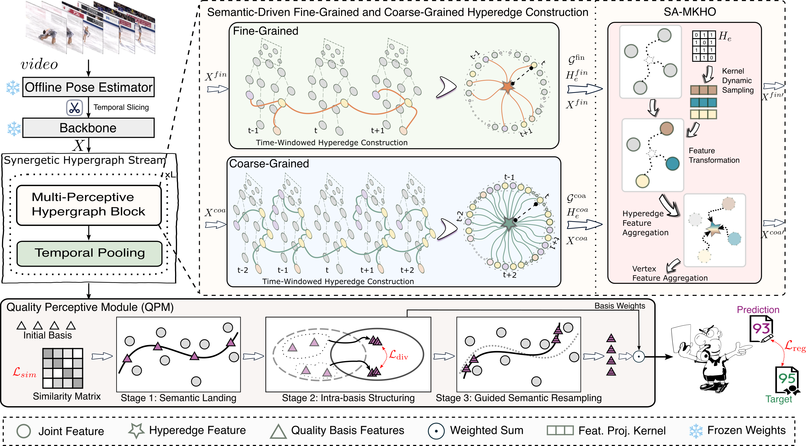

  

    <h1>
       H-SynerFlow: Learning Synergetic Spatio-Temporal Flows via Hypergraph Structures for Action Quality Assessment
    </h1>
  

  

      <a href='https://orcid.org/0009-0000-0369-8254'>Shaowu Yao</a> &emsp; 
      <a href='https://orcid.org/0000-0003-3573-4226'>Qing Lei</a> &emsp; 
      Hongbo Zhang &emsp; 
      <a href='https://orcid.org/0000-0003-2386-770X'>Jixiang Du</a> &emsp; 
      Jin Gou &emsp; 
      <a href='https://toyamaailab.github.io/'>Shangce Gao</a>
  

    

> 🚧 We provide the skeleton data used in this paper. The full source code will be made available once the paper is accepted.

## Data Preparation

We experimented on two action quality assessment datasets: **RG** and **Fis-V**.

#### RG-skeleton

[RG](https://github.com/qinghuannn/ACTION-NET?tab=readme-ov-file) is a rhythmic gymnastics dataset for action quality assessment which only provides raw video without skeleton data. We extracted skeletons from each frame in RG by [Openpose](https://github.com/CMU-Perceptual-Computing-Lab/openpose). The extracted skeleton data can be directly downloaded from GoogleDrive(Coming soon) or [BaiduYun](https://pan.baidu.com/s/1ELsLgQ7wmFI7MmS3THeG1A?pwd=nn5i).

#### Fis-V-skeleton

[Fis-V](https://github.com/chmxu/MS_LSTM) is a figure skating dataset. We applied the same data processing strategy to extract skeleton data. The extracted data can be directly downloaded from GoogleDrive(Coming soon) or [BaiduYun](https://pan.baidu.com/s/1EVGI3YuJ2xYq-_j6UcKnXQ?pwd=4cis).

## Acknowledgements

Our work benefited from several outstanding projects in related areas, including: [DHG (hypergraph)](https://github.com/iMoonLab/DeepHypergraph), [ST-GCN (action recognition)](https://github.com/yysijie/st-gcn/tree/master), and [MAGR (action quality assessment)](https://github.com/ZhouKanglei/MAGR_CAQA).

If you have any questions, you can contact 📧email: yaozhen625 at gmail.com.